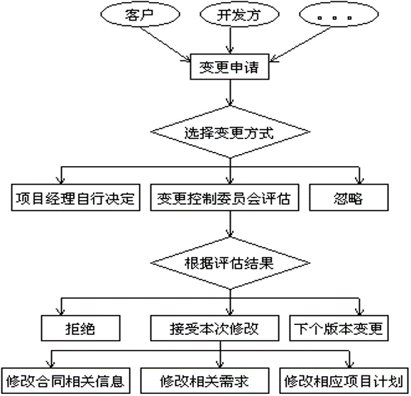
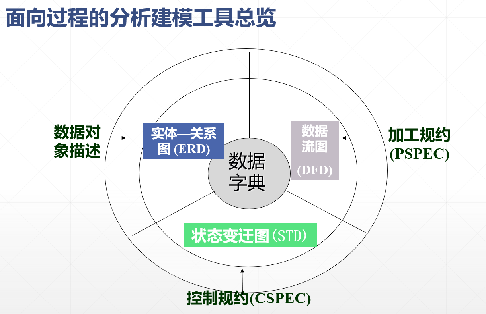

# 软件工程复习
## 1. [概述](E:/Java_and_softwarePractice/软件工程/1概述.pptx)
<!-- TODO -->

## 2. [软件过程模型](E:/Java_and_softwarePractice/软件工程/2软件过程模型.pptx)
- 软件生命周期：软件产品或软件系统从设计、投入使用到被淘汰的全过程
 

- 软件过程是在工作产品构建过程中，所需完成的活动、动作和任务的集合。
 

- 常见模型
  **1. 瀑布模型和V模型
  2. 原型和增量模型
  3. 螺旋模型和喷泉模型
  4. 基于构件的开发模型
  5. 统一开发模型
  6. 敏捷开发过程**
  

## 3. [需求分析](E:/Java_and_softwarePractice/软件工程/3需求分析.pptx)

- 需求分析：确定系统必须具有的功能和性能，系统要求的运行环境，并且预测系统发展的前景。
  - **需求获取->需求提炼->需求描述->需求验证；** 
  - **需求变更**

- 需求类型：功能性需求 & 非功能性需求

- 需求获取的来源、技术、困难

- 任务：
  1. **建立分析模型**：准确地定义未来系统的目标，确定为了满足用户的需求系统必须做什么。 
  2. **编写需求说明**：用《需求规格说明书》规范的形式准确地表达用户的需求。  
 

#### 1. 需求分析和管理
       

#### 2. 需求提炼：
  - 对应用问题及环境的理解和分析，为问题涉及的信息、功能及系统行为建立模型。将用户需求精确化、完全化，最终形成下一步的需求规格说明书
   - 核心是**建立分析模型**。
   - 采用多种形式描述需求，建立需求的多种视图，揭示出更深的问题。
   - 与客户交流，明确需求优先级，确保达成共识
    

#### 3. 软件需求说明书（SRS）：软件系统的需求规格说明，是对待开发系统的行为的完整描述。它包含了功能性需求和非功能性需求。
   -  需求分析工作完成的一个*基本标志* 是形成了一份完整的、规范的需求规格说明书。
   -  目的：确保使用者和开发者对软件有相同理解
       
#### 4. 需求验证：
   - 目的：及时验证，及时纠错，避免更大损失
   - 工作内容：
     - 有效性检查：不同用户使用不同功能的有效性
     - 一致性检查：文档中，需求之间不应该冲突
     - 完备性检查：需求文档应该包括所有用户想要的功能和约束
     - 先是向检查：能利用现有技术实现需求
   - 需求验证技术：
     1. 需求评审
     2. 利用原型检验系统是否符合用户的真正需要
     3. 对每个需求编写概念性的测试用例。
     4. 编写用户手册。通俗地描述用户可见的功能。
     5. 自动的一致性分析。可用CASE工具检验
  

#### 5. 需求变更
  

#### 软件需求规格文档编制
1. 识别主要客户和共利益者
2. 与主要客户会谈“上下文无关的问题”，以确定
   - 业务需要和商业价值
   - 最终用户的特性\需要
   - 需要的用户可见输出
   - 业务约束
3. 编写项目范围的说明
4. 评审范围说明，并应客户要求修改
5. 与客户/最终用户进行协作，确定：
    - 采用标准格式记录客户可见的使用场景
    - 输入和输出
    - 重要的软件特性、功能和行为
    - 客户定义的商业风险
6. 描述场景、输入/输出、特性/功能以及风险
7. 与客户细化场景、输入/输出、特性/功能以及风险
8. 为每个用户场景、特性、功能和行为分配客户定义的优先级
9. 回顾搜集的所有信息并修订
10. 为计划活动做准备
 

- 八大原则： 
  1. 从现实中分离功能，即描述要“做什么”而不是“怎样实现”
  2. 要求使用面向处理的规格说明语言（或称系统定义语言）
  3. 如果被开发软件只是一个大系统中的一个元素，那么整个大系统也包括在规格说明的描述之中
  4. 规格说明必须包括系统运行环境
  5. 规格说明必须是一个认识模型
  6. 规格说明必须是可操作的
  7. 规格说明必须容许不完备性并允许扩充
  8. 规格说明必须局部化和松散耦合

- 文档结构（IEEE标准）：
  1. 引言 
     - a. 需求文档的目的
     - b. 文档约定
     - c. 预期的读者和阅读建议
     - d. 产品范围
     - e. 参考文献
  2. 综合描述
     - a. 产品前景
     - b. 产品功能与优先级
     - c. 用户特征
     - d. 运行环境
     - e. 设计与实现上的限制
     - f. 假设和依赖性

  3. 需求描述
     - a. 功能需求
     - b. 数据需求：与功能有关的数据定义和数据关系
     - c. 性能需求：响应时间、容量要求、用户数等
     - d. 外部接口：用户界面、软硬件接口、通信接口
     - e. 设计约束：软件支持环境、报表、数据命名等
     - f. 软件质量属性（可维护性、可靠性、可移植性、可用性、安全性等）
     - g. 其他需求
    - 这一节是文档中**最实质性**的部分，由于在机构组织的实践中存在极大的变数，对这一节定义的标准结构可以进行增删。
  4. 附录（词汇表、分析模型、待定问题列表）
  5. 索引

#### 分析模型工具
 | |面向过程的需求分析|面向对象的需求分析 |
  |---|---|---|
 |数据模型|实体-联系图(ERD) 数据字典(DD)|类图 类关系图|
 |功能模型|数据流图（DFD）|用例图|
 |行为模型|状态变迁图(STD)|活动图 时序图 状态图|

#### 需求分析模型
- 面向过程分析模型：
  - 其基本思想是用系统工程的思想和工程化的方法，根据用户至上的原则，自始自终按照*结构化、模块化，自顶向下* 地对系统进行分析与设计。

- 面向对象分析模型：
  - 由5个层次（*主题层、对象类层、结构层、属性层和服务层*）和5个活动（*标识对象类、标识结构、定义主题、定义属性和定义服务* ）组成。

##### 面向过程分析模型
- 面向**数据流**进行需求分析的方法

- 结构化分析方法适合于**数据处理**类型软件的需求分析

- 具体来说，结构化分析方法就是用抽象模型的概念，按照软件内部数据传递、变换的关系，**自顶向下逐层分解**，直到找到满足功能要求的所有可实现的软件为止

**非常重要的图**
- **数据流图P31-72**
- **用例图P73-96**